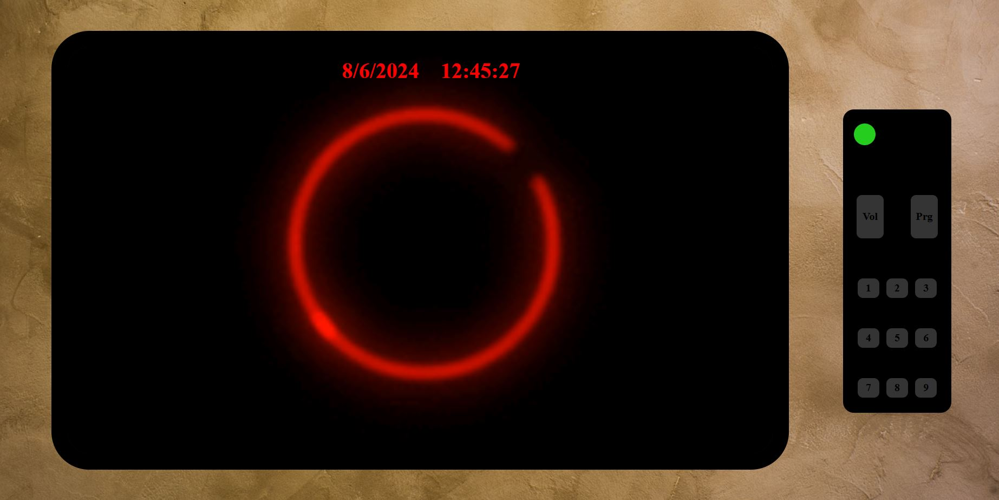

# TV interactiva🖥️

## Table of Contents

- [Description](#description)
- [Design](#design️)
- [Webgrafia](#webgrafia)
- [Stack](#stack)
- [Author](#author)

## Description📚
In the following project, part of Geekshubs, the development of an interactive television interface with a remote control is proposed using web technologies such as HTML, CSS and JavaScript.

The main goal is to create an intuitive and functional user experience that simulates interaction with a real television.

## Design🖋️

The design of the project consists of an interactive television with a remote control which we can both plug in and turn off the TV and it will show us the date and the supposedly selected channel on the screen.

## Webgrafia

Resources with which I have completed the project:
 - [Gifs](https://gifer.com/es/)

## Stack

## Author

- **David Fernandez Valle**
  - [GitHub](https://github.com/Davfernandezz)